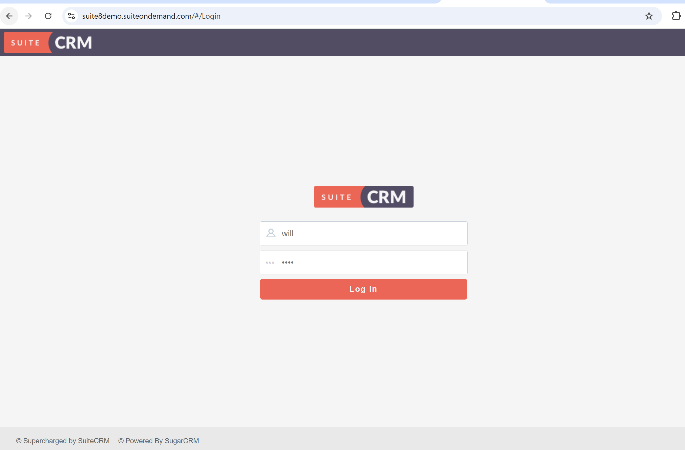
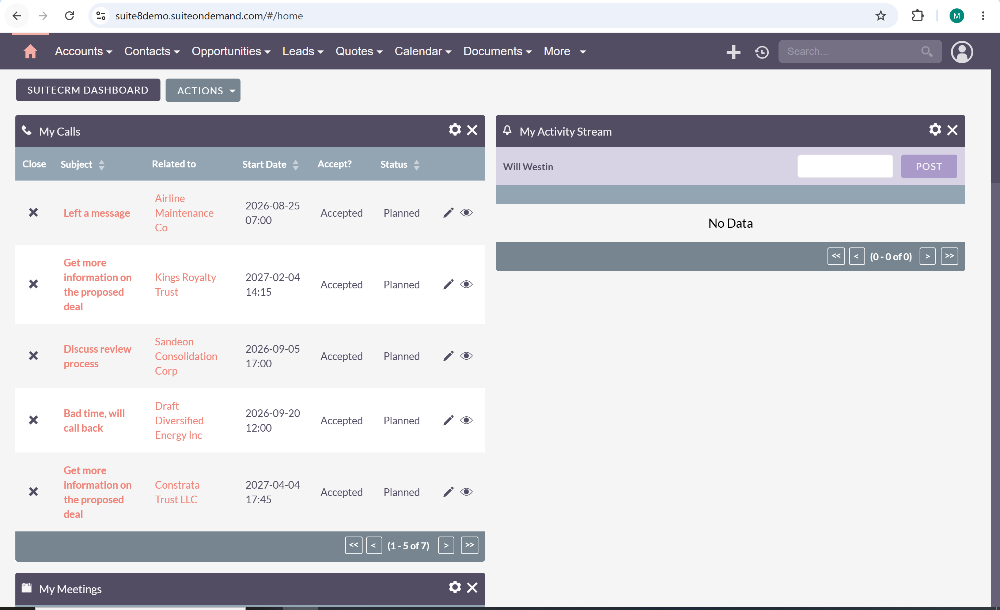
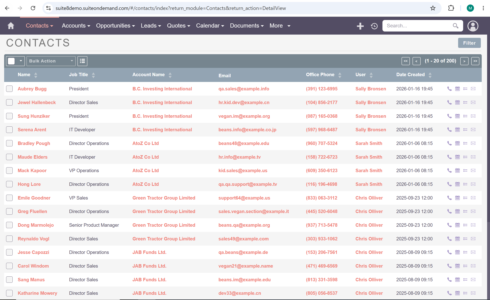
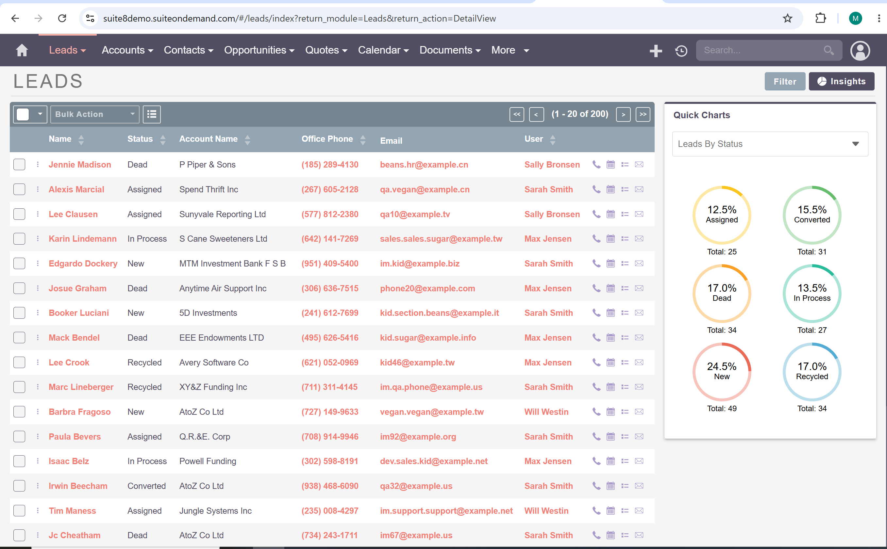
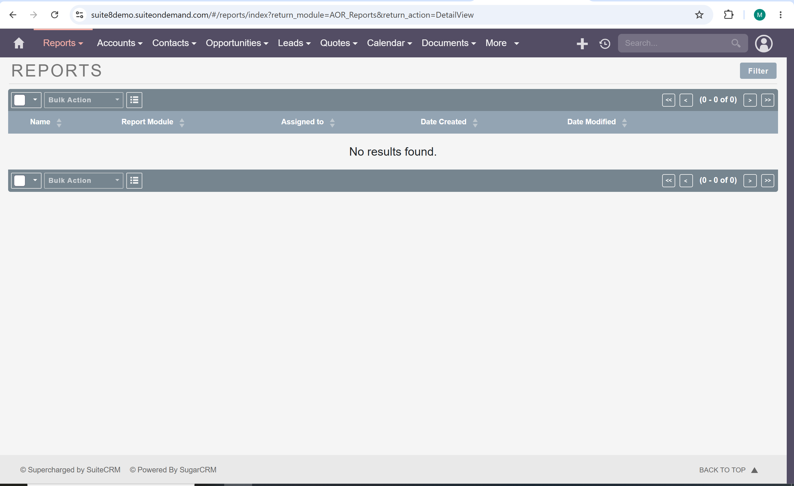

# CRM Research and Evaluation

## Part 1 – AI-Based CRM Discovery

### 1. What is CRM?

Customer Relationship Management (CRM) is a software system that helps organizations to take care of their interactions with customers, prospects, partners, and other stakeholders. CRM systems also help centralized customers information and provide tools for sales, marketing, customer service, and reporting.

#### Purpose

The primary purpose of a CRM system is to improve customer relationships and business performance. CRM software helps organizations store customer data, track communications, manage sales opportunities, and improve customer satisfaction.

#### History

CRM has changed a lot over time. In the past, businesses used simple tools to save customer information. Later, they used better systems to help with sales and customer work. Today, CRM systems use the internet, cloud, and smart technology like AI to help companies work faster and better.

#### Evolution

* Contact Management Systems
* Sales Force Automation (SFA)
* Web-Based CRM
* Cloud CRM
* AI-Powered CRM

#### Reflection

**AI Tool Used:** ChatGPT

**Was the response complete?**
The response provided a good overview of CRM concepts, history, and evolution.

**Did you verify the information?**
Yes. Information was compared with CRM vendor websites and google.com

**Trustworthiness:**
High for general concepts, although verification was necessary for historical details.

---

### 2. Why Do Organizations Use CRM Systems?

#### Sales Management

CRM systems help sales teams track leads, opportunities, customer interactions, and sales performance.

#### Customer Management

Organizations use CRM systems to maintain customer profiles, communication histories, and preferences in a one location.

#### Marketing

CRM software helps businesses with marketing and finding customers. It can send emails, group customers into different types, and help create campaigns. It also helps companies find new customers who might want to buy their products.

#### Customer Support

Support teams use CRM systems to manage customer issues, service requests, and support tickets.

#### Reporting and Analytics

CRM systems provide dashboards, reports, and analytics that help managers make informed business decisions.

#### Reflection

**AI Tool Used:** ChatGPT

**Was the response complete?**
The explanation covered the primary business uses of CRM systems.

**Did you verify the information?**
Yes. 

**Trustworthiness:**
High because the information was consistent across multiple sources.

---

### 3. What Business Problems Do CRM Systems Solve?

#### Retail

CRM systems help retailers track customer purchases, preferences, and loyalty programs.

#### Healthcare

Healthcare organizations use CRM systems to manage patient communications, appointment reminders, and engagement programs.

#### Education

Educational institutions use CRM software to manage student recruitment, admissions, and communication with prospective students.

#### Manufacturing

Manufacturing companies use CRM systems to manage customer accounts, distributors, and sales pipelines.

#### Nonprofits

Nonprofit organizations use CRM systems to manage donors, fundraising campaigns, volunteers, and event participation.

#### Reflection

**AI Tool Used:** ChatGPT

**Was the response complete?**
The examples covered multiple industries and common business challenges.

**Did you verify the information?**
Yes. 

**Trustworthiness:**
Moderate to high because business use cases vary among organizations.

---

### 4. Major CRM Modules

#### Contacts

Stores customer and prospect information.

#### Accounts

Stores information about organizations and companies.

#### Leads

Tracks potential customers before qualification.

#### Opportunities

Tracks potential sales and revenue opportunities.

#### Activities

Records meetings, calls, and interactions.

#### Tasks

Tracks assigned work and follow-up actions.

#### Marketing Campaigns

Supports promotional and lead-generation activities.

#### Customer Support Tickets

Tracks customer issues and service requests.

#### Reports

Generates detailed business reports, using charts and graphs.

#### Dashboards

Provides visual summaries of key performance indicators.

#### Reflection

**AI Tool Used:** ChatGPT

**Was the response complete?**
Yes. The response covered the major modules found in most CRM platforms.

**Did you verify the information?**
Yes. Module lists were compared across multiple CRM products.

**Trustworthiness:**
High because the modules are common standards.

---

# Part 2 – AI-Assisted CRM Product Comparison

## Commercial CRM Products

| Product                    | Target Customer             | Strengths                                       | Weaknesses                           | Pricing Model |
| -------------------------- | --------------------------- | ----------------------------------------------- | ------------------------------------ | ------------- |
| Salesforce                 | Large organizations         | Extensive features, customization, integrations | Expensive and complex                | Paid subscription  |
| HubSpot CRM                | Small to medium businesses  | Easy to use, free tier available                | Advanced features require paid plans | Free + paid plans     |
| Zoho CRM                   | Small and medium businesses | Affordable and feature-rich                     | User interface can be overwhelming   | Paid subscription  |
| Microsoft Dynamics 365 CRM | Medium to large enterprises | Strong Microsoft integration                    | Higher learning curve                | Paid ubscription  |

## Open Source CRM Products

| Product  | Features                                | Technology Stack   | Community Support | Ease of Installation |
| -------- | --------------------------------------- | ------------------ | ----------------- | -------------------- |
| SuiteCRM | Contacts, Leads, Opportunities, Reports | PHP, MySQL         | Strong            | Moderate             |
| EspoCRM  | CRM, Email Integration, Reporting       | PHP, MySQL         | Good              | Easy                 |
| Odoo CRM | CRM, ERP Integration, Sales Automation  | Python, PostgreSQL | Strong            | Moderate             |

## Analysis

### Which Commercial CRM Appears Most Popular?

Salesforce appears to be the most popular CRM platform due to its use by large companies around the world, it extensive ecosystem, and widespread enterprise adoption.

### Which Open-Source CRM Appears Most Mature?

SuiteCRM appears to be the most mature open-source CRM because of its long development history, large user community, and broad feature set.

### Which CRM Would You Recommend for a Small Business?

HubSpot CRM is recommended for small businesses because it provides a free version, simple deployment, and user-friendly features.

### Which CRM Would You Recommend for a Large Enterprise?

Salesforce is recommended for large enterprises because it offers advanced customization, scalability, analytics, and integration capabilities.

---

# Part 3 – Open Source CRM Exploration

## Selected CRM

SuiteCRM was selected for evaluation because a widely used open-source CRM platform with comprehensive CRM functionality.

## Required Screenshots

### Login Screen

Insert screenshot:



### Dashboard

Insert screenshot:



### Contacts Module

Insert screenshot:



### Leads Module

Insert screenshot:



### Reports Module

Insert screenshot:



## Installation Experience

No installation process because I use a live demo of SuitCRM (Experience the Latest Advancements with SuiteCRM 8).  The link is: https://suitecrm.com/demo/ 

### Challenges Encountered

* No challenges, the webpage was design with easy platform.

### How AI Helped

ChatGPT assisted by explaining steps and link the SuiteCRM page.

## Product Experience

### Features That Impressed Me

* Lead management
* Contact management
* Dashboard customization

### Features That Were Missing

* Built-in AI features

### Would I Use It in a Real Organization?

Yes. I would recommend SuiteCRM for small and medium-sized organizations because it offers CRM features without licensing costs and easy to use. Most important it can custom made of each dashboard. 

---

# Part 4 – AI-Assisted CRM Architecture Exploration

## Functional Modules

The proposed CRM system should include:

* Authentication
* User Management
* Contacts Management
* Leads Management
* Opportunities Management
* Activities Tracking
* Tasks Management
* Reports
* Dashboard

## Database Design

### Users

Stores user account information.

### Roles

Stores permissions and role definitions.

### Contacts

Stores customer contact information.

### Accounts

Stores organization information.

### Leads

Stores potential customer records.

### Opportunities

Stores sales opportunities.

### Activities

Stores meetings, calls, and interactions.

### Tasks

Stores assigned activities.

### Tickets

Stores customer support requests.

## Useful Libraries

| Library    | Purpose                               |
| ---------- | ------------------------------------- |
| Bootstrap  | Responsive user interface development |
| DataTables | Searchable and sortable tables        |
| Chart.js   | Dashboard charts and analytics        |
| PHPMailer  | Email functionality                   |
| Composer   | PHP dependency management             |

## Security Considerations

### Authentication

Require secure login mechanisms and session management.

### Authorization

Implement role-based access control.

### Password Security

Store passwords using strong hashing algorithms.

### SQL Injection Prevention

Use prepared statements and parameterized queries.

### Cross-Site Scripting (XSS)

Validate and sanitize user input.

### Data Privacy

Protect customer information and comply with privacy regulations.

## MVP Proposal

The minimum viable CRM should include:

* User login
* Contact management
* Lead management
* Task management
* Dashboard
* Basic reporting

These features provide sufficient functionality for managing customer relationships while keeping development effort manageable.

## Architecture Diagram

```text
+--------------------+
|      Browser       |
+--------------------+
           |
           v
+--------------------+
| HTML/CSS/JS        |
| Bootstrap/jQuery   |
+--------------------+
           |
           v
+--------------------+
| PHP Application    |
| Business Logic     |
+--------------------+
           |
           v
+--------------------+
| MySQL Database     |
+--------------------+
```
